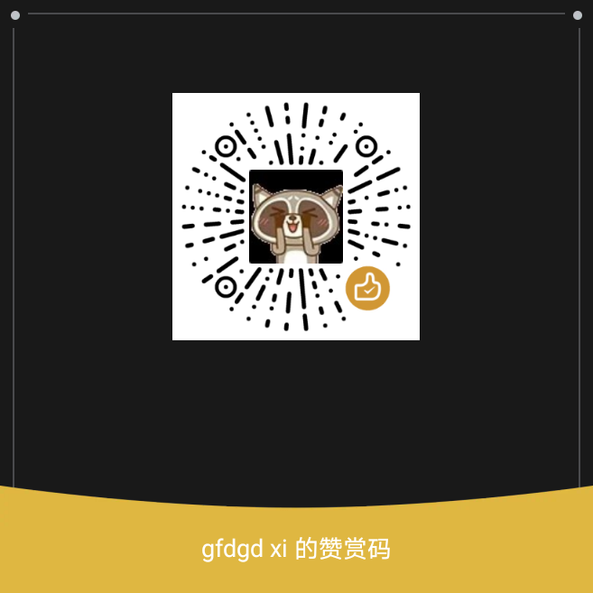

<p width=100px align="center"></p>
<h1 align="center">Wine 运行器 4.0.0</h1>
<hr>
<a href='https://gitee.com/gfdgd-xi/deep-wine-runner/stargazers'></img></a>
<a href='https://gitee.com/gfdgd-xi/deep-wine-runner/members'></img></a>  

## 介绍
Wine运行器是一个能让Linux用户更加方便地运行Windows应用的程序。原版的 Wine 只能使用命令操作，且安装过程较为繁琐，对小白不友好。于是该运行器为了解决该痛点，内置了对Wine图形化的支持、Wine 安装器、微型应用商店、各种Wine工具、自制的Wine程序打包器、运行库安装工具等。  
它同时还内置了基于Qemu/VirtualBox制作的、专供小白使用的Windows虚拟机安装工具，可以做到只需下载系统镜像并点击安装即可，无需考虑虚拟机的安装、创建、分区等操作，也能在非 X86 架构安装 X86 架构的 Windows 操作系统（但是效率较低，可以运行些老系统）。    

而且对于部分 Wine 应用适配者来说，提供了图形化的打包工具，以及提供了一些常用工具以及运行库的安装方式，以及能安装多种不同的 Wine 以测试效果，能极大提升适配效率。  
且对于 Deepin23 用户做了特别优化，以便能在缺少 i386 运行库的情况下运行 Wine32。同时也为非 X86 架构用户提供了 Box86/64、Qemu User 的安装方式  

当前支持 amd64、arm64、mips64el、loong64（新世界）、loongarch64（旧世界）、riscv64  

注：  
**在使用运行器时不要随便动  .deepinwine 下的容器，否则会导致安装的 wine 应用无法正常打开**  
**除非你有把握不会损坏容器**  


Wine Runner is a program that allows Linux users to run Windows applications more conveniently. It has built-in support for Wine graphics, various Wine tools, self-made Wine program packager and runtime installation tools. It also has a built-in Windows virtual machine installation tool based on VirtualBox, which is specially used by Xiaobai. You can download the system image and click Install without considering the installation, creation and partitioning of virtual machines.   
 
  

[](https://gitee.com/gfdgd-xi/deep-wine-runner/stargazers)    
最后感谢 [@鹤舞白沙](https://bbs.deepin.org/user/227203) 编写的《Wine运行器和Wine打包器傻瓜式使用教程（小白专用）》，链接：https://bbs.deepin.org/post/246837  

打包器视频教程：https://www.bilibili.com/video/BV1Bh4y1Q7nT/  
Wine 运行器 QQ 交流群：762985460  
Wine 运行器离线包下载地址：https://www.123pan.com/s/pDSKVv-pAJWv.html     

### Wine 运行器 For Termux 安装方法以及注意事项
见 https://gitee.com/gfdgd-xi/deep-wine-runner-termux  
https://github.com/gfdgd-xi/deep-wine-runner-termux  

### 如何手动下载 Wine？
下载链接: http://ctfile.gfdgdxi.top/d/31540479-61624693-080e74?p=2061 (访问密码: 2061)

### 如果使用更新版本的 Qemu？
后续版本将支持调用以下链接 deb 包安装的 Qemu  
Wine运行器Qemu: http://ctfile.gfdgdxi.top/d/31540479-61635610-54327c?p=2061 (访问密码: 2061)  
https://sourceforge.net/projects/deep-wine-runner/files/Wine%20Runner%20Qemu%20Extra/  


### Debian sid 依赖
https://gfdgdxi.lanzouw.com/b0plly5cj  
密码:b346  

### 如何在 deepin23 for loong64 安装
可以在 星火应用商店 for loong64 安装，也可以手动补充依赖进行安装  
依赖包地址（二选一）：https://gitee.com/gfdgd-xi/deep-wine-runner-deepin23-loong64-depends  
或 https://gfdgdxi.lanzouw.com/b0plktfvc  
密码:f67c

### 注
spark-deepin-wine-runner 是普通包，spark-deepin-wine-runner-ace 是使用 ace 兼容环境运行的运行器

## Wine 运行器离线包
### X86
123pan：https://www.123pan.com/s/pDSKVv-pAJWv.html  
百度网盘：https://pan.baidu.com/s/1klBw63tw2_ZQLzmi11dDBw?pwd=7bu5 提取码: 7bu5  
诚通网盘：http://ctfile.gfdgdxi.top/d/31540479-59254792-909739?p=2061 (访问密码: 2061)  
Github：https://github.com/gfdgd-xi/deep-wine-runner/releases/  
Sourceforge：https://sourceforge.net/projects/deep-wine-runner/files/  
更多需求需要私聊作者定制（有偿服务）
### ARM
需要私聊作者定制（有偿服务）  

## 软件架构
理论上支持全架构，如果 Python 能运行的话  
非 X86 架构会利用到 `box86`/`box64`、`exagear`、`qemu` 等技术  

## Wine 运行器自动构建（Newest）
此只供尝鲜，不保证能用：https://github.com/gfdgd-xi/deep-wine-runner/actions/workflows/auto-building.yml  

## 目前实现功能（部分）
1. 用 Wine 运行 EXE
2. 支持下载/安装 Wine
3. 支持下载定制好的 Chroot 容器并使用 Qemu 调用运行
4. 支持**半自动**安装 Windows 7 镜像至 VirtualBox/Qemu
5. 支持打包 Wine 应用（简易打包器/基于生态适配脚本的打包器/高级打包器）
6. 检测容器缺失 DLL 并下载
7. 支持在线/本地拉取 Wine 容器配置方案并部署（初步应用商店）
8. 支持安装 Windows 运行库（例如 .net framework、Mono、Gecko、Visual Studio C++）
9. 支持 Wine 快捷键映射
10. 支持调用 box86、exagear、Qemu 等工具跨架构运行 Wine
11. 支持管理 Wine 自动生成的快捷方式
12. 支持使用 Geek Uninstaller 卸载程序
13. 支持自定义生成 .desktop 到桌面和启动器
14. 支持下载适配常用字体
15. 支持终止指定容器运行的所有程序

## 上架到的应用商店
> 可以从下列应用商店获取 Wine 运行器
### Deepin/UOS 应用商店
  

### 星火应用商店
  

### 龙芯应用合作社


## 分支介绍
### main 分支
主分支，稳定分支

## 版本区分（从 3.1.0 版本开始不再区分）
### 无特殊标识
普通版本（一般来自 Gitee、Github、Gitlink 等渠道）  
### 版本号带`-spark`
星火应用商店版本  
### 版本号带`-uos`
深度应用商店版本，一般带免开开发者模式签名  
### 包名带`-52`（已停止支持）
吾爱论坛专版，只在吾爱论坛发布，功能会阉割（如更新、评分、bug反馈功能等等），一般建议使用上面的三个版本  
  
（没人喜欢看到这个无法连接服务器吧）    

## 使用说明
### 均在软件的“小提示”里有说明
### 运行器
1、使用终端运行该程序，可以看到 wine 以及程序本身的提示和报错;  
2、wine 32 位和 64 位的容器互不兼容;  
3、所有的 wine 和 winetricks 均需要自行安装（可以从 菜单栏=>程序 里面进行安装）  
4、本程序支持带参数运行 wine 程序（之前版本也可以），只需要按以下格式即可：  
```bash
exe路径\' 参数 \'
```
即可（单引号需要输入）  
5、wine 容器如果没有指定，则会默认为 ~/.wine  
6、如果可执行文件比较大的话，会出现点击“获取该程序运行情况”出现假死的情况，因为正在后台读取 SHA1，只需要等一下即可（读取速度依照您电脑处理速度、读写速度、可执行文件大小等有关）  
7、对于非 X86 的用户来说，请不要使用本程序自带的 Wine 安装程序和 Windows 虚拟机安装功能（检测到为非 X86 架构会自动禁用）  
8、如果非 X86 的用户的 UOS 专业版用户想要使用的话，只需要在应用商店安装一个 Wine 版本微信即可在本程序选择正确的 Wine 运行程序   
9、在使用 linglong 包的 Wine 应用时，必须安装至少一个 linglong 的使用 Wine 软件包才会出现该选项，而程序识别到的 Wine 是按 linglong 的使用 Wine 软件包名的字母排序第一个的 Wine，且生成的容器不在用户目录下，而是在容器的用户目录下（用户目录/.deepinwine、/tmp、桌面、下载、文档等被映射的目录除外），同理需要运行的 EXE 也必须在被映射的目录内  
10、如果是使用 Deepin 23 的 Wine 安装脚本，请切记——安装过程会临时添加 Deepin 20 的 apt 源，不要中断安装以及千万不要中断后不删除源的情况下 apt upgrade ！！！中断后只需重新打开脚本输入 repair 或者随意安装一个 Wine（会自动执行恢复操作）即可。以及此脚本安装的 Wine 无法保证 100% 能使用，以及副作用是会提示  
```bash 
N: 鉴于仓库 'https://community-packages.deepin.com/beige beige InRelease' 不支持 'i386' 体系结构，跳过配置文件 'main/binary-i386/Packages' 的获取。  
```
  
### 打包器
1、deb 打包软件包名要求：  
软件包名只能含有小写字母(a-z)、数字(0-9)、加号(+)和减号(-)、以及点号(.)，软件包名最短长度两个字符；它必须以字母开头
2、如果要填写路径，有“浏览……”按钮的是要填本计算机对应文件的路径，否则就是填写安装到其他计算机使用的路径  
3、输入 wine 的容器路径时最后面请不要输入“/”  
4、输入可执行文件的运行路径时是以“C:/XXX/XXX.exe”的格式进行输入，默认是以 C： 为开头，不用“\”做命令的分隔，而是用“/”  
5、.desktop 的图标只支持 PNG 格式和 SVG 格式，其他格式无法显示图标  

### 基于统信 Wine 生态适配脚本的打包器
第一个文本框是应用程序中文名  
第二个文本框是应用程序英文名  
第三个文本框是最终生成的包的描述  
第四个选择框是desktop文件中的分类  
第五个输入框是程序在 Wine 容器的位置，以 c:\\XXX 的形式，盘符必须小写，用反斜杠，如果路径带用户名的话会自动替换为$USER  
而 StartupWMClass 字段将会由程序自动生成，作用如下：  
desktop文件中StartupWMClass字段。用于让桌面组件将窗口类名与desktop文件相对应。这个值为实际运行的主程序EXE的文件名，wine/crossover在程序运行后会将文件名设置为窗口类名  
第六个输入框是最终生成的包的包名,包名的命名规则以deepin开头，加官网域名（需要前后对调位置），如还不能区分再加上应用名  
最后一个是最终生成的包的版本号，版本号命名规则：应用版本号+deepin+数字  


## 更新日志 
### 4.0.0（2024/07/22）
**※1、优化运行器窗口大小机制**  
**※2、Wine 安装器支持根据机器实际情况自动推荐适合的 Wine**  
**※3、Wine 安装器支持手动导入 Wine 7z 包并提供相应 7z 包的网盘下载地址**  
**※4、兼容 Deepin 终端（deepin 15 经典版本，deepin-terminal-gtk）**  
**※5、跟进 dxvk 2.4**  
**※6、修复 deepin 23 无法使用 Mono/Gecko 安装器的问题**  
**※7、修复 debian testing 打包时会把 / 打入 .7z 包内导致系统死机的问题**  
**※8、支持 AOSC（安同）、小小电脑、proot 容器**  
**※9、支持在 Termux 直接运行（单独提供安装包）**  
10、修复虚拟机启动器入口不会调用安装的 Qemu Extra 的问题  
11、优化高级打包器容器名称生成机制  
12、修复部分机器无法正常打开高级打包器的问题  
13、修复高级打包器选择Wine封装入deb模式时helper只能使用spark dwine helper的问题  

  
  
  

### 3.9.2（2024/06/29）
**※1、移除冗余组件**  
**※2、修复 Wine 安装器在文件下载失败后无法自动关闭进度条和解除控件禁用的问题**  
**※3、Wine 打包器不允许版本号开头输入首字母以及版本号不允许出现空格**  
**※4、Wine 打包器生成的 deb 同时支持使用 spark-dwine-helper 和 deepin-wine-helper**  
**※5、支持调用拓展 Qemu**  
**※6、新增滚动条，优化小屏幕使用体验**  


### 3.9.1（2024/06/07）
**※1、修复 Windows 虚拟机安装工具安装程序在 Mips 架构无法正确启动虚拟机的问题**  
**※2、优化打包器依赖**  

### 3.9.0（2024年06月01日）
**※1、UOS Mips64（如 3a4000）用户无需手动降级 Qemu 即可正常开启使用虚拟机**  
**※2、修复开启部分 exe 提示参数有误的问题**  
**※3、Qemu 在启动时可以按 ESC 键打开启动菜单**  
**※4、虚拟机工具 Windows 7 自动安装镜像文件选项内置 Virtio 驱动安装包**  
**※5、Qemu 虚拟机参数调整若干**  
**※6、修复虚拟机安装工具系统安装选项会自动跳回第一项的问题**  
**※7、优化简易打包器包名识别机制**  
**※8、减少不必要的压缩以减少打包器打包 deb 所需时间**  
**※9、修复简易打包器生成的 deb 包无法运行的问题**  
10、优化 lat 安装脚本  
11、调整星火 Wine 助手路径  


  


### 3.8.0（2024年04月27日）
**※1、修复系统/应用运行库无法下载的问题**  
**※2、打包器支持指定打包架构为 loong64、loongarch64、armhf 和 amd64**  
**※3、更新 Geek Uninstaller 版本**  
**※4、默认开启英语翻译**  
**※5、更新 dxvk 版本**  
**※6、修复新版本 Qemu 没有 --soundhw 参数导致无法正常开启虚拟机的问题**  
**※7、支持 Qemu 磁盘扩容**  
8、修复问题 https://gitee.com/gfdgd-xi/deep-wine-runner/issues/I9B4L0  
9、针对 Loongarch ACE 做特别优化  

**※1. Repair system/application library download failed problem**  
**※2. Support building loong64, loongarch64, armhf and amd64 architecture deb with packager** 
**※3. Update Geek Uninstaller version**  
**※4. Enable English translation by default**  
**※5. Update dxvk version**  
**※6. Repair virtual machine running problem with newer Qemu**  
**※7. Support adding space with Qemu virtual disk**  
8. Fixed an issue related to https://gitee.com/gfdgd-xi/deep-wine-runner/issues/I9B4L0  
9. Added support for Loongarch ACE


### 3.7.0（2024年02月02日）
**※1、修复简易打包器在 Deepin/UOS 上无法正常启动的问题**  
**※2、打包器生成的 deb 修复在非 Deepin/UOS 且未安装星火应用商店的系统中启动器无程序图标的问题**  
**※3、修复 Box86/64 国内源源失效的问题**  
**※4、适配 Arch Linux**  
**※5、适配 Fedora**  
**※6、打包器支持将 deb 包转换为其它格式**  
**※7、适配 deepin 23 beta3**  
8、新增公告和新版本提示功能  
9、修复公告的链接在部分机器无法正常打开的问题  
10、新增赞赏入口  
11、支持识别 spark-wine9、spark-wine9-wow  


### 3.6.1（2023年12月25日）
**※1、修复应用无法打开的问题**  
**※2、修改错别字**  

### 3.6.0（2023年12月24日）
**※1、修复高级打包器选择软件适配脚本后无法打包的问题 https://gitee.com/gfdgd-xi/deep-wine-runner/issues/I8I110**  
**※2、支持调用 Deepin Wine8 Stable**  
**※3、移除过时的 Wine 安装程序入口**  
**※4、Wine 安装器支持根据地区自动选择国内源以及国际源**  
**※5、Wine 安装器新增 Sourceforge 源**  
**※6、新增 Wine 运行报告生成功能**  
**※7、初步英语翻译**  
**※8、新增离线安装包（只支持 amd64）**  
**※9、支持识别 /opt 文件夹下的 Wine**  
10、新增 Wine 运行器视频教程的 Youtube 入口  


### 3.5.0（2023年11月17日）
**※1、虚拟机工具支持 kvm 检测**  
**※2、修改虚拟机工具提示文本，新增对 UOS 3a4000 用户无法正常使用 Qemu 的解决方案**  
**※3、在主界面点击“安装”按钮后自动切换至帮助页面**  
**※4、新增虚拟机日志输出和读取功能**  
**※5、新增Qemu测试测试功能**  
**※6、虚拟机工具支持安装/运行 arm32、arm64 架构的系统**  
**※7、修复虚拟机工具在系统版本选择第 5 项及以后出现不会挂载 ISO 的问题（使用 Qemu 的情况下）**  
**※8、修复简易打包器无法打开的问题 https://gitee.com/gfdgd-xi/deep-wine-runner/issues/I85F9M**  
**※9、生态适配脚本打包器支持正确根据打包结果显示打包成功/失败 https://gitee.com/gfdgd-xi/deep-wine-runner/issues/I7D83Z**  
10、生态适配脚本打包器设置使用 xz 格式打包 deb  
11、新增 ace 包  
12、虚拟机工具支持强制关闭 VirtualBox/Qemu，并增加了对 Windows 7 安装脚本的检测  
13、新增 lat 翻译器安装选项  


### 3.4.1（2023年09月30日）
**※1、支持识别 spark-wine8-wow 且打包时可以使用该 wine**  
**※2、替换安装 Box86 的 pkexec 为 sudo**  
**※3、Wine 下载工具新增更多 Wine**  


### 3.4.0.1（2023年08月18日）
**※1、修复部分高性能机器打包器提示“无效的压缩参数”：https://gitee.com/gfdgd-xi/deep-wine-runner/issues/I7SMTJ**  
**※2、支持设置程序字体大小：https://gitee.com/gfdgd-xi/deep-wine-runner/issues/I7SAYE**  

### 3.4.0（2023年08月11日）
**※1、修复简易打包器无法打开的问题以及 Wine 识别错误的问题**  
**※2、高级打包器支持多 .desktop 分别设置不同的 MimeType**  
**※3、修复运行器在 Ubuntu 23 的安装问题**  
**※4、高级打包器支持导出/导入填写信息**  
**※5、Deepin 23 支持使用 Winetricks**  
**※6、新增视频教程**  
**※7、修复虚拟机工具在检测到 Qemu 磁盘但没有安装 Qemu 时无法启动的问题**  
**※8、修复虚拟机工具的一些问题并调整部分设置**  
**※9、虚拟机工具支持设置 UEFI 启动**  
**※10、虚拟机安装工具提供 LoongArch 新世界版本**  
11、高级打包器支持隐藏输入框以及使用小字体  
12、打包器提供 bcm 和 dcm wine 支持  
13、修复星火 wine 配置错误问题  
14、打包器支持多线程打包  
15、修复升级工具问题：https://gitee.com/gfdgd-xi/uengine-runner/issues/I6ZRZX  
16、跟进打包器 run.sh 模板  
17、云沙箱新增 cloud.vdnel.cn  
18、打包器新增分类 Game、System、AudioVideo  
19、修复安装 Box64 时源里没有 libc6:armhf 导致无法安装的问题  


### 3.3.0.1（2023年07月25日）
**※1、修复运行器打开主界面不进行任何操作但 CPU 占用率过高的问题**  
**※2、修复运行器运行器（局部）无法正常移除的问题**  

### 3.3.0（2023年07月12日）
**※1、简易打包器支持选择 Wine 版本以及修改打包生成的 deb 包的架构为 all；**  
**※2、修改容器自动配置脚本的 Gitlink 源为 Gitee 源**  
**※3、在安装更多 Wine 处安装 Wine 后主窗口 Wine 版本下拉框自动更新**  
**※4、设置打包器在 Ubuntu 依旧打包 xz 格式的 deb 包**  
**※5、修复 Wine 简易打包器 control 文件 Installed-Size 格式不规范的问题**  
**※6、更换 Box86 源并支持安装 Box64（如果为 aarch64 架构）**  
**※7、新增 Wine 自建源（支持 Debian10、Deepin20）**  
**※8、修改 WineHQ 安装器使其支持选择国内清华大学镜像源或 WineHQ 官方源**  
**※9、新增 Visual FoxPro 安装器**  
**※10、新增安装局部运行库以解决部分低版本系统运行高版本 Wine 的问题且不与其他运行库和兼容层冲突**  
**※11、支持调用原版的 Exagear 以及 Qemu User（i386、x86_64） 运行 Wine**  
12、新增自动构建：https://github.com/gfdgd-xi/deep-wine-runner/actions/workflows/auto-building.yml（只供尝鲜）  
13、新增 Wine 日构建（在“安装更多 Wine”处可以获取，目前有 i386、amd64、i386+amd64、amd64+wow64 mode、aarch64）  
14、优化容器清理脚本  
15、修复部分组件没完全换源的问题，部分组件支持自动换可用源  
  
  

### 3.2.2（2023年05月12日）
**※1. 修改源地址（迁出 Gitlink）；**  
**※2. 修复非 X86 架构运行器主页面虚拟机工具禁用的问题；**  
3、部分组件支持选择最优源。  


### 3.2.1（2023年04月29日）
**※1、Windows 虚拟机安装工具支持非 X86 架构；**  
**※2、应用打包器可以与星火应用商店配合构建 arm/all 全架构的 Wine 包；**  
**※3、Windows 虚拟机安装工具支持调用 Qemu；**  
**※4、新增 Qemu User 运行 Wine 的帮助入口；**  
**※5、修复 Windows 虚拟机的自动配置镜像缺少 aria2c.exe 的故障；**  
**※6、支持在更新程序版本时自动关闭程序进程；**  
7、运行器和打包器支持调用 spark-wine8；  
8、修改作者信息；  
9、新增安装包构建时间；  
10、优化 Wine 运行器更新策略。  


### 3.2.0（2023年03月19日）
**※1、Windows 应用适配工具新增系统资源显示；**  
**※2、Windows 应用适配工具使用 C++ 重写；**  
**※3、修复打包器（基于官方生态适配脚本）无法打开的问题；**  
**※4、新增运行库功能安装，以实现使用 Qemu User 跨架构运行 Wine 的功能（理论上支持 3a4000 了，但没试过）；**  
**※5、修复 Chroot 容器的一些问题；**  
**※6、修复在 Debian11 安装时缺失依赖 rar 的问题；**  
**※7、新增安装 box86、box64 的功能；**  
**※8、修复故障反馈功能错误的问题；**  
**※9、支持调用 Flatpak 安装的 Wine；**  
10、修改程序内的部分网址；  
11、作者信息变更；  
12、支持禁用程序的多语言支持（默认禁用，因为是机翻的）；  
13、支持在程序本地翻译缺失的情况下自动机翻缺失语句；  
14、从此版本开始不再区分吾爱版、Spark 版和 UOS 版；  
15、新增下载量查询；  
16、更新程序公告；  
17、新增断网彩蛋。  


### 3.1.0（2023年01月06日）
**※1、不基于生态适配脚本打包器支持禁用 Mono/Gecko 打包器；**  
**※2、自动容器配置脚本新增命令 decompressionbottle、programforum、installmsi 以及上述命令的帮助；**  
**※3、自动容器配置脚本新增评论功能；**  
**※4、自动容器配置脚本新增许多应用安装脚本；**  
**※5、安装 Windows 虚拟机功能更换应答镜像图标并添加常用 Windows 组件安装功能；**  
**※6、安装 Windows 虚拟机功能提供镜像下载的网盘链接；**  
**※7、简易打包器支持自动添加宋体；**  
8、修复 installfont 命令下载的字体目录错误问题；  
9、修复提交日志功能在提交成功时依旧提示提交失败问题；  
10、支持强制启用所有被禁用的组件（不推荐）。  

  

### 3.0.0（2022年12月10日）
**※1、支持使用 Qemu + Chroot 跨运行 Wine 以及指定程序的功能；**  
**※2、提供了简易打包器以用于打包简易 deb；**  
**※3、支持下载配置过的 Qemu + Chroot 容器；**  
**※4、支持在隔离的 Chroot 容器内运行 Wine；**  
**※5、支持解压指定 deb 的内打包好的容器；**  
**※6、优化 Wine 列表显示；**  
**※7、新增程序论坛和教程入口；**  
**※8、程序公告功能；**  
**※9、新增程序评分功能；**  
**※10、新增解包 deb 内 Wine 容器功能；**  
**※11、新增 Vkd3d Proton 安装功能，更新 dxvk 版本至 2.0.0；**  
**※12、新增程序菜单栏部分栏目图标；**  
**※13、打包器支持按下 Shift + F1 查看指定选项提示；**  
14、优化非基于生态适配脚本的打包器内容自动填充功能；  
15、优化程序文案；  
16、新增日志翻译功能；  
17、程序进一步完善英语翻译（机翻）；  
18、优化程序更新策略；  
19、优化日志分析功能；  
20、优化程序 UI。  
  

### 2.5.0.1（2022年11月25日）
**※1、修复已知问题**  

### 2.5.0（2022年11月25日）
**※1、容器自动配置脚本 GUI 查看介绍使用 QWebEngineWidget，支持图片（非强制依赖，只做推荐）；**  
**※2、不基于生态适配活动脚本打包器跟进 arm 架构 2022年11月11日的 Wine 微信打包方式；**  
**※3、支持多图标的程序打包；**  
**※4、修复了安装更多 Wine 换源换了个寂寞的问题；**  
**※5、修复安装更多 Wine 重新安装后列表丢失的问题；**  
**※6、新增了对 Deepin 23 Alpha 优化的 Wine 安装器；**  
**※7、新增 Dll 名称查询功能，可以查询对应 Dll 的作用；**  
**※8、支持静态获取可执行文件可以调用的 Dll 并提供解决方案；**  
**※9、支持移除指定的 .desktop 快捷方式；**  
**※10、新增日志分析功能以及导出、上传日志功能；**  
11、修复了不基于生态适配活动脚本打包器在选择 arm 打包架构下容器自动删除脚本取消勾选无用的问题；  
12、优化文案、新增友链；  
13、提供了部分组件的测试功能。  
  

### 2.4.1.1（2022年11月21日）
**※1、修复已知问题**  

### 2.4.1（2022年11月06日）
**※1、不基于生态适配活动脚本的打包器支持只生成制作容器的 7z 包**  
**※2、两个打包器的容器自动删除脚本添加 kill.sh**  
**※3、Wine 运行器支持杀死对应容器进程**  
**※4、容器自动配置脚本和 Wine 安装器支持切换源**  
5、非生态适配脚本打包器追加运行参数改为 --uri XXX 而非直接 XXX  
6、两个打包器新增星火应用商店投稿入口  
7、优化开启 Windows 虚拟机功能在未安装 VirtualBox 时的提示  
8、Reg Shot 版本从 1.8.3-beta1V5 升级到 1.9.0  
9、Geek Uninstaller 版本从 1.5.1.161 升级到 1.5.1.163  
10、容器自动配置脚本添加 installother 命令、修复返回值传递问题  
11、不显示 pip 安装库的提示信息（因为不是很核心的库）  
12、非基于生态适配活动脚本的打包器默认勾选卸载该 deb 后自动删除容器、使用统信活动容器清理脚本、使用星火 wine helper  
13、优化文案  


### 2.4.0（2022年10月25日）
**※1、新增 VB Runtime 组件安装工具**  
**※2、优化自动配置容器搜索功能，搜索不区分大小写**  
**※3、新增 Wine 容器快捷键映射功能**  
**※4、修复在 arm 架构运行 Wine 时提示无法解压资源的问题**  
**※5、修复右键无法找到 Wine 运行器打开方式的问题**  
**※6、修复了容器自动配置脚本 GUI 解析器无法指定 Wine、容器以及位数的功能**  
**※7、容器自动配置脚本支持评分功能以及脚本内容介绍功能**  
**※8、支持添加自定义安装的 Wine**  
**※9、打包器打包的 arm 包支持同时支持 UOS 的 box86 和 exagear**  
**※10、提供了 Python 的自动配置脚本 API**  


### 2.3.0（2022年10月02日）
**※1、自动配置解释器支持 bash 语法（新版底层调用 bash，旧版任然使用旧版解析引擎）**  
**※2、修复缺失 wimtools 依赖导致无法正常安装的问题**  
**※3、修复基于生态适配活动脚本打包器对话框过多影响使用的问题，并支持指定不同的包名和容器名**  
**※4、7z 文件解压不会自动替换文件然后卡死以及因此导致程序闪退的问题**  
**※5、修复安装更多 Wine 终端调用问题和图标问题**  
**※6、支持 openkylin**  
7、支持通过 exe 路径自动生成 Wine 容器路径  
8、支持禁用/启用 wine 容器是否生成快捷方式的功能以及启用/禁用程序崩溃提示对话框  
9、支持设置 wine 容器代理  
10、自动配置脚本支持使用 `--help` 参数查看帮助  
  

### 2.2.0（2022年09月24日）
**※1、Dll 提取工具支持 NT 6.X 及以上版本的 Dll 提取并优化了提示文本**  
**※2、支持卸载后自动删除缓存/配置文件（删除配置文件只限 purge 参数删除）**  
**※3、DEBUG 模式输出更多信息以方便调试（原本只输出 pid、Err）**  
**※4、支持安装 msi 文件**  
**※5、修复无法正常评分的问题**  
**※6、修复 QQ、TIM 安装后无法正常生成快捷方式的问题**  
**※7、基于生态适配活动的打包器更换为 spark-wine-helper 以及添加自动删除残留脚本**  
**※8、打包器支持从 deb 文件读取信息**  
**※9、修复在 UOS 专业版（鲲鹏）无法正常运行的问题以及组件安装功能无法正常执行安装命令的问题**  
**※10、修复出现星火应用商店和官方应用商店反复提示更新死循环的问题**  
**※11、新增评分分数预测功能（不准）**  
**※12、更换程序接口**  
13、更新组件安装的离线列表  
14、不再强制依赖深度终端，只做推荐安装  
15、基于生态活动适配脚本的打包器在打包完成后会弹出对话框提示打包完成  
16、优化打包器的 spark wine helper 依赖设置方式  
17、新增 RegShot（注册表比对工具）  
18、添加 Wine 运行器评分数据的搜索功能  
  

### 2.1.0-2（2022年09月05日）
**※1、修复终端调用问题**  

### 2.1.0-1（2022年09月03日）
**※1、删除多余图标**  
**※2、修复将打包文件生成目录设置为 / 等重要目录导致删库的问题**  
3、修复了打包器浏览按钮闪退、生成的 postrm 有误的问题  
4、支持在输入信息时自动生成 deb 保存路径  

### 2.1.0（2022年08月26日）
**※1、新增新的 Wine 安装器，并支持将安装的 Wine 打包到 Wine 程序 deb 包中**   
**※2、Wine 打包器打包 Windows 应用支持将 Wine 打包入 deb 内，可以不依赖 Wine（一般不推荐把 Wine 打包入内，推荐用依赖的形式），并支持设置自定义依赖和生成模板**  
**※3、开始初步多语言支持**  
**※4、修复了在没有安装任何 Wine 的情况下使用高级功能导致程序闪退的问题**  
**※5、支持云端自动获取数据配置 Wine 容器**  
**※6、支持手动导入配置文件自动配置 Wine 容器**  
**※7、新增从云端下载 Dll 的功能**  
**※8、修复了 Dll 提取工具不会在 winecfg 中添加原装的问题**  
9、修改错别字（图形话=>图形化）  
10、修复评分功能名称为空也可以上传评分的问题  
11、去除 toilet 依赖，使在 Deepin 23 Preview 上运行更佳  
12、支持删除所有由 Wine 创建的启动器快捷方式  


### 2.0.0-2（2022年08月16日）
修复了在 deepin 23 安装缺少`toilet`依赖导致无法安装的问题，更多更新内容请见 2.0.0    

### 2.0.0-1（2022年08月15日）
修复了缺失`python3-psutil`依赖的问题，更多更新内容请见 2.0.0  

### 2.0.0（2022年08月13日）
**※1、修复了重复路径一直自动重复增加的问题**  
**※2、修复了两个打包器打包错误的问题（非基于生态活动脚本的为 wine 导入错误，基于生态活动脚本的为架构有误导致打包出的 deb 无法打包）**  
**※3、适配了部分非 i386、amd64 架构计算机的 UOS 系统使用的 wine 并支持打包非 i386、amd64 架构计算机的 UOS 系统使用的 wine 程序 deb 包**  
**※4、支持安装 dxvk（遵守 Zlib 开源协议）**  
**※5、运行器、打包器（包括非基于生态适配活动脚本制作的）支持使用 Wine 生态适配活动的容器清理脚本**  
**※6、支持更加简易的安装最新版的 WineHQ**  
**※7、增加字体商店**  
**※8、新增查看可执行文件运行情况的功能**  
9、支持不显示没有安装的 Wine，方便用户识别  
10、修改了 Wine 的顺序使其更加合理  
11、支持删除安装 exe 后在启动器的快捷方式  
12、优化了 Wine 打包器（非基于生态活动脚本）对容器的处理  
13、修复了 Wine 打包器（非基于生态活动脚本）打包出的 deb 安装时显示为解压缩后会消耗 0 B 的额外空间以及 postrm 的一些问题  
14、支持删除无需使用的程序组件  
15、支持组件/运行库下载后缓存方便下次使用（可以清理）  
16、点击获取图标按钮后会自动读取 exe 框的程序图标（不支持相对路径和包内路径，只支持绝对路径）  
  

### 1.8.0（2022年08月03日）
**※1、修复了打包器（非基于活动脚本） control、postrm 写入文件颠倒的问题**  
**※2、内置一个微型的 Windows 应用商店（应用来源：腾讯软件管家）**  
**※3、初步支持 deepin 23（添加基于 linglong Wine 的运行方式，需要安装一个 linglong 包的 使用 Wine 应用；添加从 Deepin 20 源获取 Wine 的安装方式）**  
4、更新了打包器（非基于活动脚本）调用星火 spark-wine-helper 的 run.sh 脚本格式  
5、修复了打包器（基于活动脚本）在 dde-top-panel 和 dde-globalmenu-service 下无法打开帮助提示的问题  
6、支持屏蔽 Wine 默认的 Mono、Gecko 安装器（屏蔽方法来自星火应用商店审核组和提供的新 run.sh 标准）  
  
  

### 1.7.1（2022年07月29日）
**※1、更换为 @PossibleVing 提供的程序图标**  
**※2、修改了统信 Wine 生态适配活动的脚本，支持在非 UOS 系统打包**  
**※3、修复了打包器在打包应用未指定图标的情况下显示对话框后强制退出的问题**  
4、修改 .net framework 3.5 的安装包，从在线版改为本地版  
5、支持设置主题  
6、添加 Geek Uninstaller 手动升级脚本  


### 1.7.0（2022年07月19日）
<b>※1、界面大改造，从使用 Tkinter 改为 Qt，参考了 @134******28 和 @sgb76 提供的设计方案和代码</b>  

**※2、添加了基于 UOS 生态适配活动打包脚本的打包器，以及基于 Virtualbox 的简易 Windows 镜像安装工具**  
**※3、将 pip 由阿里源改为华为源，提升下载安装速度，并删除使用 pip 下载库的功能（已不需要，废弃）**  
4、添加 @delsin 和 @神末shenmo 建议的 postrm 脚本  
5、优化多屏窗口居中问题  
6、修复 1.6.0 程序无法保存设置的问题  
7、修复 1.6.0 的更新程序无法正常更新的问题  
8、升级 Geek Uninstaller 版本  


### 1.6.0（2022年07月10日）
**※1、新增程序感谢、谢明以及程序的建议和问题反馈和内置更新程序**  
**※2、支持 winetricks 指定 Wine 打开**  
**※3、新增窗口透明工具，感谢@a2035274 和 @虚幻的早晨 在论坛的讨论**  
**※4、支持在指定容器、Wine 安装 MSXML**  
**※5、支持启用/关闭 opengl（感谢@zhangs 在论坛发帖）以及支持安装/卸载 winbind**  
**※6、添加云沙箱的网站链接快捷方式**  
**※7、支持从星火应用商店源安装 Windows 常见字体**  
8、优化窗口布局以及默认显示位置  
9、支持打开指定容器、Wine 的资源管理器  


### 1.5.3（2022年07月07日）
**※1、新增专门的程序设置，支持设置 Wine 容器架构、DEBUG 信息是否输出、默认的 Wine、默认容器路径、是否使用终端打开和 Wine 参数**  
**※2、修复了 wine 打包器的控件禁用不全和打包的 deb 用户残留的问题**  
**※3、新增暗黑主题**  
4、合并了 deepin wine 文管设置器  


### 1.5.2（2022年07月06日）
**※1、添加并翻新了 deepin-wine5 打包器，改为 wine 打包器，支持常见 wine 的打包**  
**※2、新增 Visual Studio C++ 的安装程序**  
**※3、新增从系统安装镜像提取 DLL 到 wine 容器的功能（当前只支持 Windows XP 和 Windows Server 2003 的官方安装镜像）**  
4、修复了安装星火应用商店的 wine 运行器右键打开方式没有 wine 运行器选项的问题  
5、新增脚本，优化 deepin terminal 调用本程序脚本显示不佳的问题  


### 1.5.1（2022年07月04日）
**※1、支持打开 spark-wine7-devel 的专门缩放设置（如未安装则此按钮禁用）**  
**※2、支持提取选择的 exe 文件的图标**  
**※3、支持向指定的 wine 容器安装 mono、gecko、.net framework（此功能在菜单栏“Wine”中，卸载只需要使用程序的卸载按钮打开 Geek Uninstaller 即可）**  
**※4、支持指定特定的 wine 容器调用 winetricks**  
**※5、在没有指定 wine 容器的情况下，将自动设置为 ~/.wine**  
6、新增 ukylin-wine  
7、将默认选择的 wine 改为 deepin-wine6 stable  
8、支持打开指定容器的 winecfg、winver、regedit、taskmgr  
9、双击使用 wine 运行器打开 exe（不知道能不能生效） 


### 1.5.0（2022年07月03日）
**※1、支持显示 wine 程序运行时的返回内容**  
**※2、优化打包方式，减少从 pip 安装的库，并将 pip 源设为阿里源提升下载速度**  
**※3、新增 spark-wine7-devel**  
**※4、支持从程序启动用于安装 wine 的程序（在菜单栏的“程序”）**  
5、优化 wine 安装脚本，在安装星火应用商店的 wine 时支持检测是否有 ss-apt-fast，如果有就调用替代 apt 提升安装速度  
6、支持关闭指定 wine 的进程，以及访问对应 wine 容器的目录和字体目录  
7、从生成shell脚本改为升级到desktop文件  


### 1.4.0（2021年07月27日）
**※1、修改了 wine 选项的说明和 wine 的启动方式;**  
**※2、设置了窗口主题;**  
**※3、修改了打包以及 .desktop 文件**  
4、删除了以前的残略调试代码;  
5、优化了 wine 列表的显示流程;  
6、更新了“关于”窗口  
7、更新了提示内容  
8、在 gitee/github 仓库上添加了 wine 安装脚本  
  

### 1.3.1（2021年05月23日）
1、添加了历史记录，使用更加方便  
2、增加“更新内容”项  
3、支持浏览窗口的默认路径为上次访问的路径  
4、支持清空历史记录  
5、代码结构优化  
6、修改了控件大小  


### 1.3.0（2021年05月22日） 
1. 修改了窗口显示控件的库（从 tkinter 到 tkinter.ttk）
2. 添加了更多 wine 可以选择（deepin-wine、deepin-wine5、wine、wine64、deepin-wine5-stable、deepin-wine6-stable）
3. 修改了程序的提示信息


### 1.2.0（2021年03月14日） 
1. 修改布局方式
2. 轻度梳理代码布局


### 1.1.2 （未发布发行版）
1. 进行了细节优化

### 1.1.1（2021年01月31日）
1. 使用多线程，防止界面假死
2. 添加软件图标


### 1.1.0（2021年01月29日）
1. 修改了代码的部分内容，使其支持容器路径可带空格无需“\”转义，以及支持手动保存运行脚本到桌面

### 1.0.0（2021年01月29日）
1. 实现内容

## 构建安装包
### deb
```bash
make package-deb -j4
```
### pkg
```bash
make package-deb -j4
make package-pkg -j4
```
## Openkylin 如何安装这个 Wine 运行器？
现在可以直接安装了 

## 对于 Deepin/UOS（AMD64 平台）小白如何使用该程序？
下面是送给小白的 wine 运行器简单使用方法，先声明，wine 并***不能完美的运行所有 exe 文件***，利用此 wine 运行器简易安装可执行文件的方法如下：  

1. 安装本程序
2. 在应用商店里随便安装一个 QQ 或者微信等基于 deepin-wine6-stable 打包的应用
   
3. 找到需要安装的 exe，双击或者右键=》打开方式=》wine 运行器打开
   
4. 点击“运行程序”即可
   


## 下载链接
Gitee：https://gitee.com/gfdgd-xi/deep-wine-runner  
Github：https://github.com/gfdgd-xi/deep-wine-runner  
Sourceforge：https://sourceforge.com/projects/deep-wine-runner
蓝奏云：https://gfdgdxi.lanzouj.com/b01nz7y3e，密码:7oii  
星火应用商店：spk://store/tools/spark-deepin-wine-runner  

## 更多
+ https://gitee.com/gfdgd-xi/deep-wine-runner
+ https://github.com/gfdgd-xi/deep-wine-runner
+ https://www.gitlink.org.cn/gfdgd_xi/deep-wine-runner

## 程序安装量/打开量（自动统计）
   
   

## Star 一下吧
开发不易，原创艰难，给一个 Star 吧，你的 Star 是我继续开发的动力  
  

## 运行库下载
| 架构 | 运行库下载 |
|-|-|
| i386 | https://jihulab.com/gfdgd-xi/qemu-runtime/-/raw/main/i386-runtime-for-qemu_1.0.0_all.deb |
| amd64 | https://jihulab.com/gfdgd-xi/qemu-runtime/-/raw/main/amd64-runtime-for-qemu_1.0.0_all.deb |
| armhf | https://jihulab.com/gfdgd-xi/qemu-runtime/-/raw/main/armhf-runtime-for-qemu_1.0.0_all.deb |
| arm64 | https://jihulab.com/gfdgd-xi/qemu-runtime/-/raw/main/arm64-runtime-for-qemu_1.0.0_all.deb |
| mips64el | https://jihulab.com/gfdgd-xi/qemu-runtime/-/raw/main/mips64el-runtime-for-qemu_1.0.0_all.deb |
| ppc64el | https://jihulab.com/gfdgd-xi/qemu-runtime/-/raw/main/ppc64el-runtime-for-qemu_1.0.0_all.deb |
| riscv64 | https://jihulab.com/gfdgd-xi/qemu-runtime/-/raw/main/riscv64-runtime-for-qemu_1.0.0_all.deb |
| s390x | https://jihulab.com/gfdgd-xi/qemu-runtime/-/raw/main/s390x-runtime-for-qemu_1.0.0_all.deb |

## 附：用于编译 Wine 的 Docker 容器（Debian10）
内安装了编译 Wine 所需要的依赖，Wine 编译教程：https://wiki.winehq.org/Building_Wine  
当然也可以到 http://wine.wine-runner.gfdgdxi.top/ 或 Wine 运行器内下载已经编译好的 Wine  
（屏蔽微信在Wine中运行时产生的水印/黑块？可以参考：https://12101111.github.io/block-wine-wechat-black-window/ 和 https://blog.csdn.net/ericden/article/details/122118443 ）
### 拉取
***（需要先安装 Docker 后再输入以下命令）***  
Docker 镜像下载链接：  
```bash
sudo docker load -i wine-latest-debian10.tar.gz
```
### 启用
```bash
sudo docker run -it wine /bin/bash
```
### 编译 Wine 例子（以 8.3 为例）
```bash
cd /root
## 先编译 amd64 版本的 Wine
# 安装依赖库（amd64 和 i386 的相互冲突）
sudo apt install libpcsclite-dev libsdl2-dev samba-dev -y
# 下载源码
wget https://dl.winehq.org/wine/source/8.x/wine-8.3.tar.xz
tar -xf wine-8.3.tar.xz
# 编译
mkdir build64
cd build64
../wine-8.3/configure --enable-win64
make -j4
## 编译 i386 版本的 Wine
cd /root
# 安装依赖库（amd64 和 i386 的相互冲突）
sudo apt install libpcsclite-dev:i386 libsdl2-dev:i386 samba-dev:i386 -y
# 编译（可以参考 https://wiki.winehq.org/Building_Wine#Shared_WoW64）
mkdir build32
cd build32
PKG_CONFIG_PATH=/usr/lib32 ../wine-8.3/configure --with-wine64=../build64
make -j4
## 生成 7z 包（可选）
# 生成可执行文件
mkdir /root/program
cd /root/build32
make install DESTDIR=../program -j4
cd /root/build64
make install DESTDIR=../program -j4
# 打包 7z 包
cd /root/program/usr/local
7z a /root/wine-staging-8.3-debian10-x86_64.7z *
## 安装到 Docker 容器内（可选）
# 安装 i386
cd /root/build32
make install -j4
# 安装 amd64
cd /root/build64
make install -j4

```

## 请作者喝杯茶
如果您觉得 Wine 运行器对你有帮助，可以请作者喝杯茶  
 


### 广告
支付宝官方活动，扫描获得支付红包！  
<p></p>

# ©2020-Now gfdgd xi